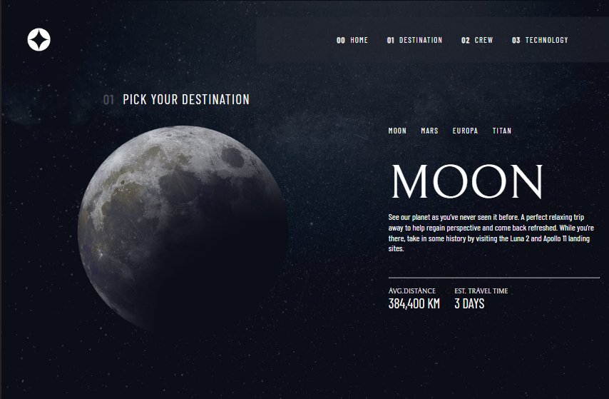

# Frontend Mentor - Space tourism website solution

  

  <a href="#-tecnologias">Tecnologias</a>&nbsp;&nbsp;&nbsp;|&nbsp;&nbsp;&nbsp;
  <a href="#projeto">Projeto</a>&nbsp;&nbsp;&nbsp;|&nbsp;&nbsp;&nbsp;
  <a href="#desafio">Desafio</a>&nbsp;&nbsp;&nbsp;|&nbsp;&nbsp;&nbsp;
  <a href="#O-que-aprendi">O que aprendi</a>&nbsp;&nbsp;&nbsp;|&nbsp;&nbsp;&nbsp;
  <a href="#melhorias">Melhorias</a>&nbsp;&nbsp;&nbsp;&nbsp;&nbsp;&nbsp;

Esta é uma solução para uma das páginas do desafio [Space tourism website challenge on Frontend Mentor](https://www.frontendmentor.io/challenges/space-tourism-multipage-website-gRWj1URZ3). Os desafios do Frontend Mentor te ajudam a melhorarsuas habilidades em codar construindo desafios realistas. 

## 🚀 Tecnologias

Esse projeto foi desenvolvido com as seguintes tecnologias:

- HTML e CSS
- JavaScript
- Figma
- Git e Github

## Projeto

O desafio da frontend mentors é fazer um site completo e responsivo para uma agencia de viagens espaciais. Como parte do meus estudos montei a estrutura de uma dessas páginas, onde respeite o layout proposto.

## Desafio

Como parte de um exercicio para HTML e CSS, o desenvolvedor deve ser capaz de:

- Desenvolver um layout utilizando HTML e CSS puro
- Utilizar elementos de imagens, formulários, títulos e fontes customizadas.

Veja o resultado através do <a href="https://space-travel-iota.vercel.app/">link do Vercel</a>

## O que aprendi

Ao fazer este desafio como volta aos estudos de programação front-end, fui capaz de rever conceitos importantes como os:

- Montagem de layouts com HTML e CSS
- Tags que possuem sintaxe para ferramentas de busca
- Respeitar a estrutura proposta em FIGMA

## Melhorias

Como este pequeno projeto se trata apenas de uma página de um desafio maior, as próximas atualizações serão:

- Adicionar novas páginas propostas pelo designer
- adicionar responsividade no layout
- utilizar bobliotecas e frameworks para a estruturação e navegação na página
